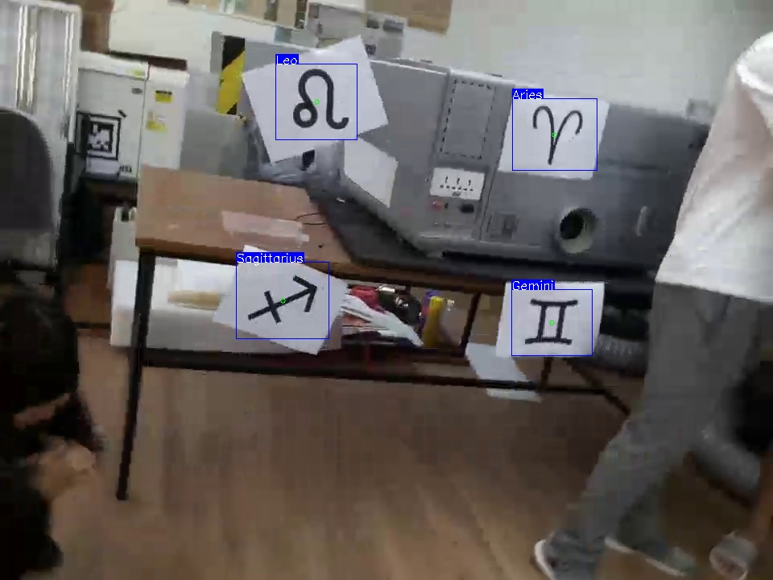
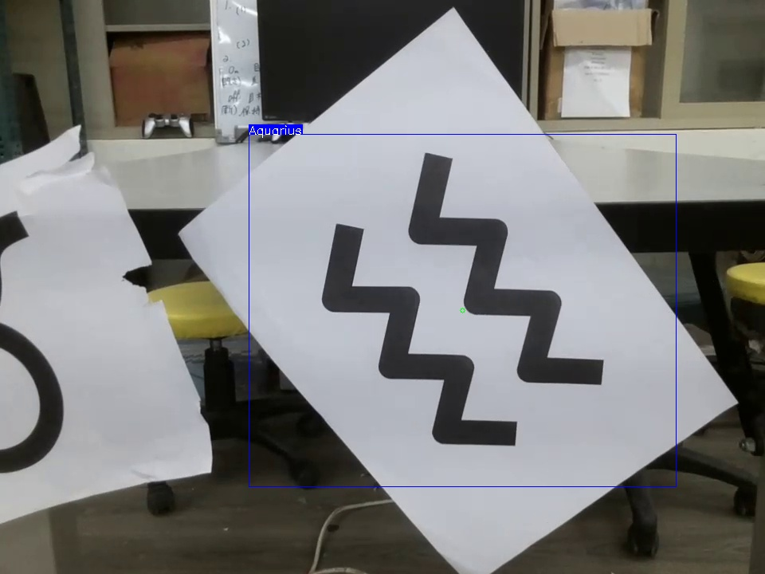
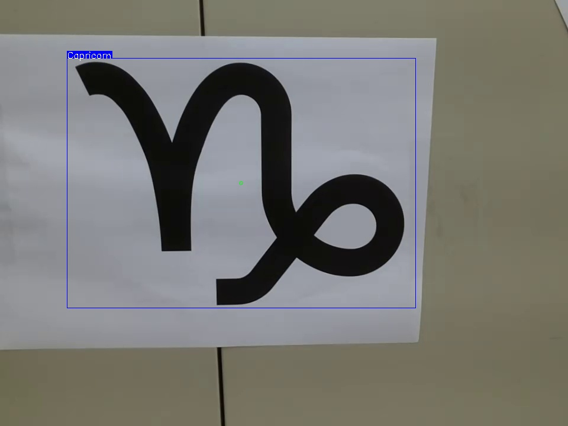

# Human Centric Computing Lab
2021 Spring in-class midterm project

# Environment
### Python 3 + Windows
``` shell
pip install -r yolov5/requirements.txt
pip install -r requirements.txt
```

### Python 3 + Linux
``` shell
pip3 install -r yolov5/requirements.txt
pip3 install -r requirements.txt
```

# Resources
- dataset
  - https://drive.google.com/drive/folders/19X1T0NN91ZBwucYzr_Zdzsqw--IbbjXE?usp=sharing
- pre-trained weights for yolov5l
  - https://drive.google.com/file/d/1-m808psmsuM3bASCK0qKbl90AidxNahR/view?usp=sharing


# Execution
### Python 3 + Windows
``` shell
python HCC_midterm.py \
--weights_path {path to weights file} \
--target {0 ~ 11}
```

### Python 3 + Linux
``` shell
python3 HCC_midterm.py \
--weights_path {path to weights file} \
--target {0 ~ 11}
```

The argument of `target` is according to the table below :
| target | constellation |
| :----: | :-----------: |
|   0    |     Aries     |
|   1    |      Leo      |
|   2    |  Sagittarius  |
|   3    |    Taurus     |
|   4    |     Virgo     |
|   5    |   Capricorn   |
|   6    |    Gemini     |
|   7    |     Libra     |
|   8    |   Aquarius    |
|   9    |    Cancer     |
|   10   |    Scorpio    |
|   11   |    Pisces     |

# Demo




# Collaborators
* [crydaniel1203-bit](https://github.com/crydaniel1203-bit)
* [david20571015](https://github.com/david20571015)
* [jackcyc](https://github.com/jackcyc)
* [tuchin32](https://github.com/tuchin32)